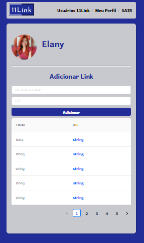
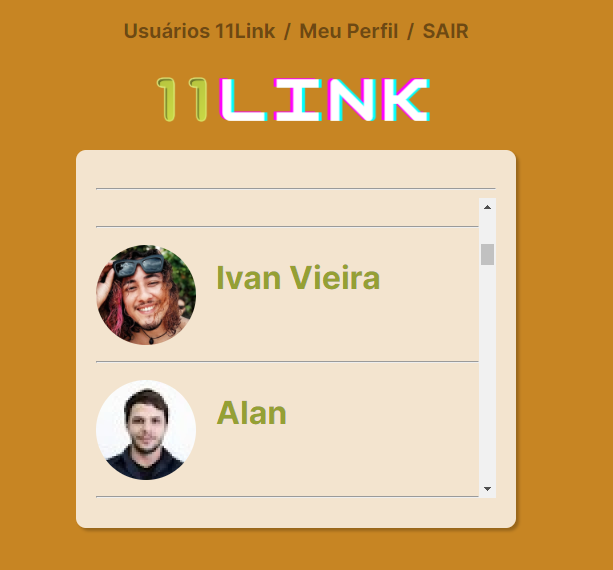

<h1 align="center">
11Link
</h1>

---

<p align="center">
  <a href="#page_with_curl-sobre">Sobre</a>&nbsp;&nbsp;&nbsp;|&nbsp;&nbsp;&nbsp;
  <a href="#hammer-tecnologias">Tecnologias</a>&nbsp;&nbsp;&nbsp;|&nbsp;&nbsp;&nbsp;
  <a href="#-requisitos">Requisitos</a>&nbsp;&nbsp;&nbsp;|&nbsp;&nbsp;&nbsp;
  <a href="#-come%C3%A7ando">Começando</a>&nbsp;&nbsp;&nbsp;|&nbsp;&nbsp;&nbsp;
  <a href="#-autores">Autores</a>
</>
  
## :page_with_curl: Sobre 

A plataforma 11Link é uma aplicação de rede social que permite aos usuários compartilhar e descobrir links interessantes. Ela foi desenvolvida com o objetivo de criar uma experiência de compartilhamento de conteúdo mais interativa e eficiente.

**Recursos Principais:**
- Autenticação de Usuários
- Compartilhamento de Links
- Visualização de Links Compartilhados
- Interface Amigável e Responsiva
  
<p align="center">
    
</>
  
## :hammer: Tecnologias
Esse projeto foi desenvolvido com as seguintes tecnologias:

- [REACT](https://react.dev/)


- [React](https://reactjs.org/): Biblioteca JavaScript para a construção da interface do usuário.
- [Ant Design](https://ant.design/): Um sistema de design de interface de usuário com componentes prontos para uso.
- [React Router DOM](https://reactrouter.com/): Biblioteca para gerenciamento de rotas no React.
- Consumo de API: Integração com uma API para obter dados de usuários e links compartilhados.

## 📚 Requisitos

Para executar este projeto em sua máquina local, você precisa ter o seguinte software instalado:

- [Git](https://git-scm.com/): Para clonar o repositório do projeto.
- [Node.js](https://nodejs.org/): Plataforma JavaScript que inclui o Node Package Manager (NPM) para instalação de dependências.

## 🚀 Começando

Siga as etapas abaixo para configurar e executar o projeto em sua máquina:

1. Clone o projeto:

   ```bash
   git clone https://github.com/develany/11group.git
   
2. Entrar no diretório:
   
   ```bash
   cd 11group

3. Instale as dependências:

   ```bash
   npm install

4. Incie o projeto:

    ```bash
   npm start

## 👥 Autores
Este projeto foi desenvolvido por:

- [Elany Peixoto](https://github.com/develany)
- [Ivan Vieira](https://github.com/ivanvrjr)
- [John Lennon](https://github.com/johnlennonop)
  
Agradecemos por usar o 11Link! Se tiver alguma dúvida ou sugestão, fique à vontade para entrar em contato com nossa equipe de desenvolvedores.

